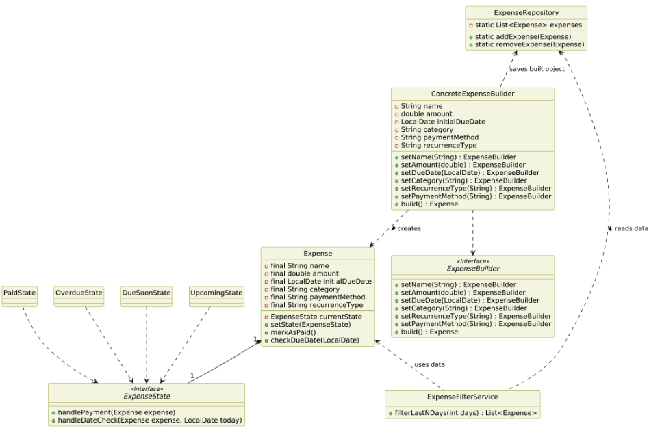

| CS-665       | Software Design & Patterns |
|--------------|----------------------------|
| Name         | Keith Kwan                 |
| Date         | 12/09/2025                 |
| Course       | Fall                       |
|           Final Project                   |

# Final Project Overview

For my final project my goal was to create an expense tracker where someone could log their expenses as well as future expenses in order to get a better picture of their finances. 

Looking at the design patterns from the website, the one that stood out to me was the builder pattern. It seemed to fit my need of creating a "complex object". The complex object being an expense object. By using the builder pattern I can have more versatility when it comes to creating expense objects as well as more rigor with validation and error checking

# GitHub Repository Link:
https://github.com/kkeith88/655-final-project

# Implementation Description 
For each assignment, please answer the following:

Explain the level of flexibility in your implementation, including how new object types can be easily added or removed in the future.
- New expense objects can easily be added by using the builder. I can also add new fields to the expense object as well as validation in the `ConcreteExpenseBuilder` class as well as modifying the interface for the `ExpenseBuilder`

Discuss the simplicity and understandability of your implementation, ensuring that it is easy for others to read and maintain.
- By using interfaces in this project it makes it easy for a new developer to join this project or someone reviewing the code to see the contracts that the concrete classes must implement. Looking at the interfaces first would give a birds eye view at first which would allow them to understand the concrete methods easier. The project also follows best practices with structure which allows others to see and focus on what they need to view, whether it be the `state` directory, or `repository`.

Describe how you have avoided duplicated code and why it is important.
- By using the builder pattern and state pattern I was able to delegate conditional logic and duplication to the concrete states and validation only in the `ConcreteExpenseBuilder`. If the state was just an attribute that held no methods, each expense object would have a chain of if/else trying to determine what state it should transition to next and if it should transition at all.
- In my project the builder does validation which allows me to only check and validate data in one place. If this project were larger and there was much more validation needed, the logic would have to be duplicated into every creation point an expense object could be created. 

If applicable, mention any design patterns you have used and explain why they were chosen.

### Design Choices / Assumptions / Thought Process:
- The project required solving a real world problem with a desgi npatter, I identified creating and managing the lifecycle of an expense were the biggest challenges I wanted to solve
- I chose the builder pattern and the state pattern to help manage the complexity of object creation as well as behavior
- Assumption: The core data of an expense is immutable, this is to maintain that the system is stable because if some edits were made to an object without validation then there can be bad data corrupting our future work
- However I will note that to counteract this, to implement an edit function I would abstract out the validation logic so that it can be reused in different situations without having code duplicatoin and rewriting.
- Some decisions were made to manage the scope of the project while still highlighting the design patterns used

# UML Diagram

This UML diagram was created using PUML, this was a new technology I found during assignment 5. I found it to work well with LLMs inside VSCode since it could crawl through the codebase. The LLM was able to give me a start on this but I did have to refine it myself.

# Maven Commands

We'll use Apache Maven to compile and run this project. You'll need to install Apache Maven (https://maven.apache.org/) on your system. 

## Compile
Type on the command line: 

```bash
mvn clean compile
```


## JUnit Tests
JUnit is a popular testing framework for Java. JUnit tests are automated tests that are written to verify that the behavior of a piece of code is as expected.

To run, use the following command:
```bash
mvn clean test
```


## Spotbugs 

SpotBugs is a static code analysis tool for Java that detects potential bugs in your code.
Use the following command:

```bash
mvn spotbugs:gui 
```

For more info see 
https://spotbugs.readthedocs.io/en/latest/maven.html

SpotBugs https://spotbugs.github.io/ is the spiritual successor of FindBugs.


## Checkstyle 

Checkstyle is a development tool for checking Java source code against a set of coding standards.
The following command will generate a report in HTML format that you can open in a web browser. 

```bash
mvn checkstyle:checkstyle
```

The HTML page will be found at the following location:
`target/site/checkstyle.html`


